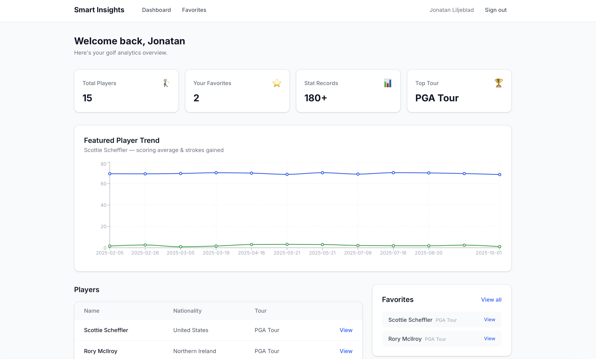
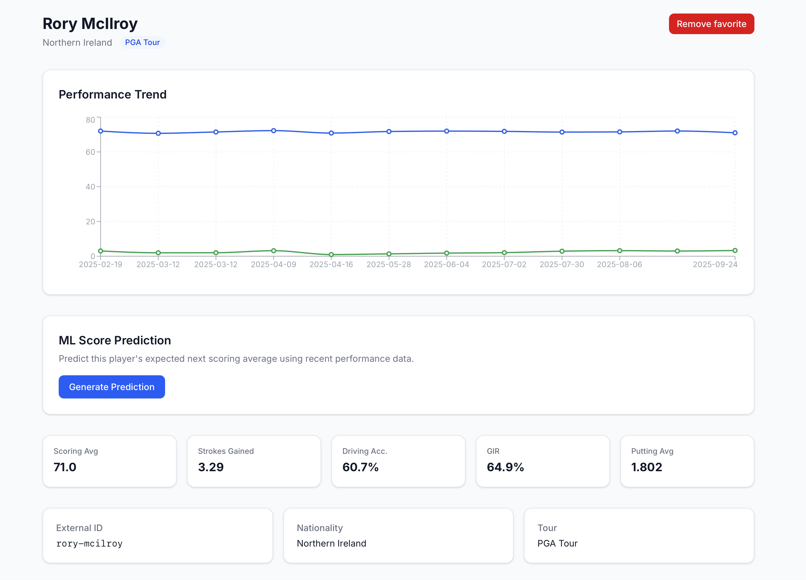

# Smart Insights Dashboard

Full-stack analytics platform that ingests player performance data, serves it through a typed REST API, and runs ML scoring predictions via an async Celery pipeline — all orchestrated across five Docker services.



---

## Demo

```bash
make up && make migrate && make seed && make train
```

| Service         | URL                         |
|-----------------|-----------------------------|
| Dashboard       | http://localhost:3000        |
| API             | http://localhost:8000        |
| Interactive Docs| http://localhost:8000/docs   |



---

## Key Features

### Data & Analytics
- Historical stat tracking across 5 performance dimensions per player
- Trend visualization (scoring average, strokes gained, driving accuracy, GIR, putting)
- Per-user favorites with dashboard-level aggregation
- Real stat cards computed from actual data — no hardcoded values

### Machine Learning
- Scoring prediction from sliding-window feature engineering over recent events
- Baseline vs improved model comparison (LinearRegression → RandomForest)
- Trained artifact served through async job pipeline — predictions never block the API
- Full job lifecycle: `pending → running → completed/failed` with error handling

### Async Processing
- Celery worker consumes jobs from Redis, runs inference, writes results to Postgres
- Frontend polls job status and renders prediction on completion
- Worker and API share the same codebase but run as independent containers

### Authentication
- JWT auth with bcrypt hashing, Bearer token scheme
- Protected routes across both API and frontend

---

## Architecture

```
┌────────────┐     ┌────────────┐     ┌────────────┐
│   Next.js  │────▶│  FastAPI    │────▶│ PostgreSQL │
│   :3000    │     │   :8000    │     │   :5432    │
└────────────┘     └─────┬──────┘     └────────────┘
                         │
                    ┌────▼─────┐
                    │  Redis   │
                    │  :6379   │
                    └────┬─────┘
                         │
                   ┌─────▼──────┐
                   │  Celery    │
                   │  Worker    │
                   └────────────┘
```

| Service    | Role                              |
|------------|-----------------------------------|
| `client`   | Next.js 15 frontend (SSR + SPA)   |
| `server`   | FastAPI REST API + auth           |
| `worker`   | Celery task processor             |
| `db`       | PostgreSQL 16, persistent volume  |
| `redis`    | Message broker + result backend   |

**Prediction request flow:**
1. `POST /api/predictions/` creates a `PredictionJob` record
2. Celery task dispatched to worker via Redis
3. Worker loads model artifact, builds feature vector from recent stats, runs inference
4. Result written to DB → client polls `GET /api/predictions/{id}` until complete

---

## ML Pipeline

```
Historical Stats → Feature Engineering → Model Training → Saved Artifact
                                                              │
Player Request → Recent Stats → Feature Vector → Inference → Result
```

| Detail            | Value                                       |
|-------------------|---------------------------------------------|
| Task              | Predict next scoring average                |
| Features          | 3-event rolling mean across 5 stat columns  |
| Baseline          | LinearRegression — RMSE 0.6264              |
| Improved          | RandomForest — RMSE 0.6211                  |
| Training set      | 135 samples from 15 players × 12 events     |
| Artifact          | `scoring_model.joblib`                      |

---

## Tech Stack

| Layer      | Technologies                                            |
|------------|---------------------------------------------------------|
| Frontend   | Next.js 15, React 19, TypeScript, Tailwind CSS, Recharts |
| Backend    | FastAPI, Python 3.12, Pydantic v2                       |
| Data       | SQLAlchemy 2.0 (typed ORM), Alembic, PostgreSQL 16     |
| Async      | Celery 5.4, Redis 7                                    |
| ML         | scikit-learn, pandas, NumPy, joblib                     |
| Auth       | JWT (python-jose), bcrypt (passlib)                     |
| Infra      | Docker, Docker Compose, Makefile                        |
| Quality    | pytest, ruff                                            |

---

## Getting Started

**Requires:** [Docker](https://docs.docker.com/get-docker/) and Docker Compose

```bash
git clone https://github.com/JonatanLiljeblad/Smart_Insight_Dashboard.git
cd Smart_Insight_Dashboard
cp .env.example .env

make up          # build and start all 5 services
make migrate     # apply Alembic migrations
make seed        # load 15 players + 180 stat records
make train       # train and save ML model artifact
```

```bash
curl http://localhost:8000/health
# → {"status":"ok"}
```

Open http://localhost:3000 → register → explore the dashboard → click a player → generate a prediction.

```bash
make down        # stop and tear down
```

---

## API

| Method | Endpoint                     | Auth   | Description                     |
|--------|------------------------------|--------|---------------------------------|
| GET    | `/health`                    | —      | Health check                    |
| POST   | `/api/auth/register`         | —      | Create account                  |
| POST   | `/api/auth/login`            | —      | Get JWT token                   |
| GET    | `/api/auth/me`               | Bearer | Current user                    |
| GET    | `/api/players/`              | Bearer | List players                    |
| GET    | `/api/players/{id}`          | Bearer | Player detail                   |
| GET    | `/api/players/{id}/stats`    | Bearer | Stat history                    |
| GET    | `/api/favorites/`            | Bearer | List favorites                  |
| POST   | `/api/favorites/`            | Bearer | Add favorite                    |
| DELETE | `/api/favorites/{id}`        | Bearer | Remove favorite                 |
| POST   | `/api/predictions/`          | Bearer | Create prediction job (async)   |
| GET    | `/api/predictions/{id}`      | Bearer | Poll job status + result        |

Interactive docs at http://localhost:8000/docs

---

## Project Structure

```
├── client/                    # Next.js frontend
│   └── src/
│       ├── app/               # Pages: dashboard, login, register, players, favorites
│       ├── components/        # UI, auth, charts, predictions
│       ├── hooks/             # useAuth, usePlayers, useFavorites, usePrediction
│       ├── services/          # Typed API client layer
│       └── types/             # TypeScript interfaces
│
├── server/                    # FastAPI backend
│   ├── app/
│   │   ├── api/routes/        # Auth, players, favorites, predictions
│   │   ├── api/dependencies/  # Auth middleware
│   │   ├── core/              # Config, security, Celery app
│   │   ├── db/                # Engine, session, DeclarativeBase
│   │   ├── models/            # User, Player, PlayerStat, Favorite, PredictionJob
│   │   ├── schemas/           # Pydantic request/response schemas
│   │   ├── services/          # Auth + prediction business logic
│   │   ├── tasks/             # Celery task definitions
│   │   └── main.py            # FastAPI entrypoint
│   ├── alembic/               # Database migrations
│   ├── scripts/               # Seed data, model training
│   └── tests/                 # pytest suite
│
├── ml/                        # Artifacts, evaluation metrics
├── docker-compose.yml         # 5-service orchestration
├── Makefile                   # Developer workflow
└── .env.example               # Environment template
```

---

## Development

| Command             | Description                              |
|---------------------|------------------------------------------|
| `make up`           | Build and start all services             |
| `make down`         | Stop and tear down                       |
| `make logs`         | Tail all service logs                    |
| `make worker-logs`  | Tail Celery worker logs                  |
| `make migrate`      | Apply database migrations                |
| `make seed`         | Seed demo data                           |
| `make train`        | Train and save ML model                  |
| `make test`         | Run pytest suite                         |
| `make lint`         | Lint with ruff                           |

---

## Design Decisions

- **Async over sync** — predictions dispatch to Celery rather than running in the request cycle. The API stays responsive regardless of model complexity or load.
- **ML as a service** — the model is trained offline, saved as an artifact, and loaded by the worker at task time. Swapping models requires no code changes to the API.
- **Separation of concerns** — routes delegate to services, services operate on models, schemas define the API contract. No ORM leakage into route handlers.
- **Shared image, separate roles** — the API server and Celery worker use the same Docker image with different entrypoints, keeping the deployment surface small.

---

## Author

**Jonatan Filip Liljeblad**
CS & Math @ Albright College · Data Analytics Minor

[LinkedIn](https://www.linkedin.com/in/jonatan-liljeblad-690344260/) · [GitHub](https://github.com/JonatanLiljeblad)

## License

[MIT](LICENSE)
